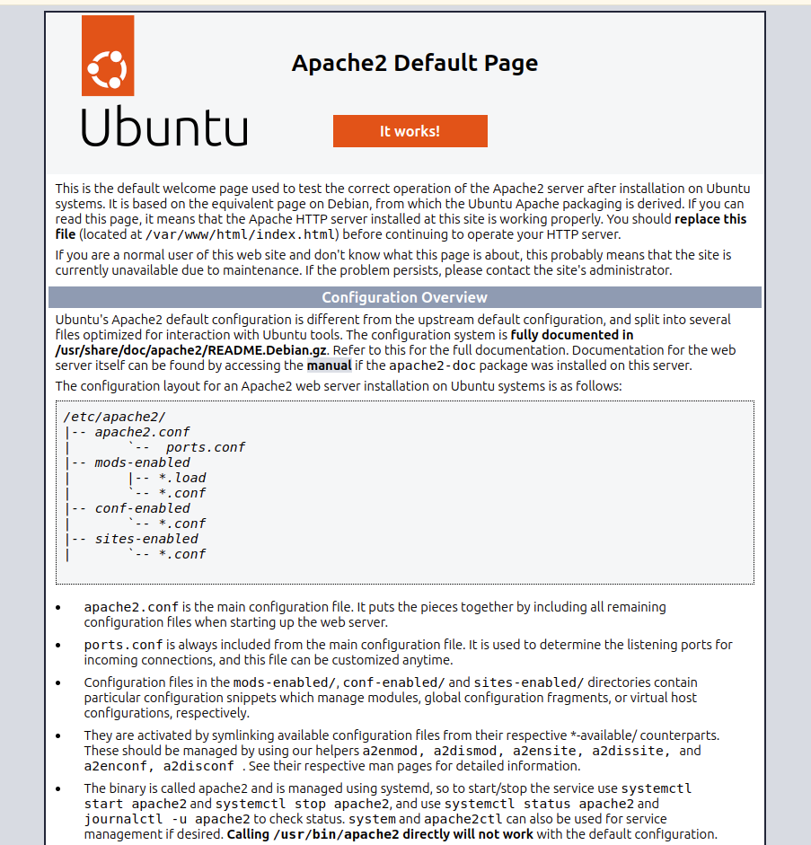

# HW1 作業
## 要求簡介
* 使用 docker 在 ubuntu 上新增一個 apache2，並能從 `localhost:80` 進行連線

## Quick Start 
* build docker `docker build -t hw1 .`
* 用 `docker image list` 檢查是否有 hw1 的 repo 
* `docker run --name cloud-hw1 -d -p 80:80 hw1` 用於啟動
* 檢查 `docker container list` 是否有 names 為 cloud-hw1 的
  
## 完成畫面
