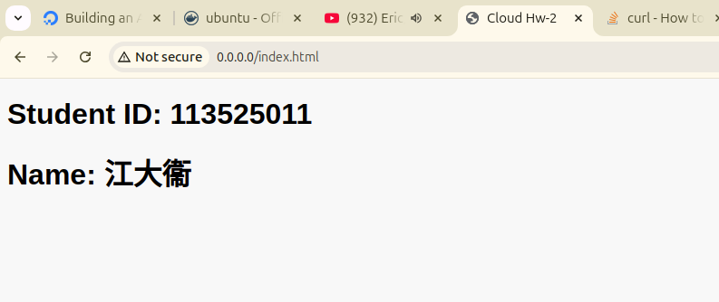

# HW2 作業
## 要求簡介
* 滿足 hw1 要求
* 建立 `index.html` 並在上面顯示名字與自己的學號

## Quick Start 
* build docker `docker build -t hw2 .`
* 用 `docker image list` 檢查是否有 hw2 的 repo 
* `docker run --name cloud-hw2 -d -p 80:80 hw2` 用於啟動
* 檢查 `docker container list` 是否有 names 為 cloud-hw2 的
  
## 完成畫面
