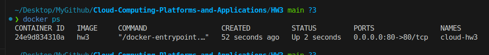
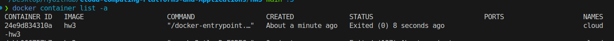
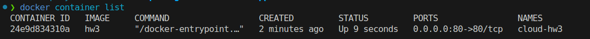
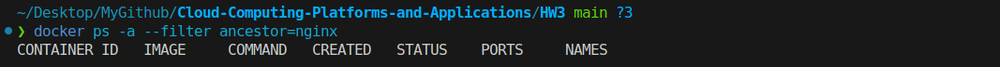
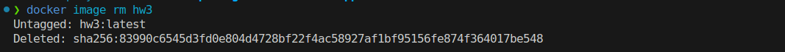

# HW3 and HW4 作業
## 要求簡介
* 使用 nginx 建立一個 dockerfile
* 能夠開啟並重新打開
* 刪除 container and image 

## Quick Start 
* build docker `docker build -t hw3 .`
* 用 `docker image list` 檢查是否有 hw3 的 repo 
* `docker run --name cloud-hw3 -d -p 80:80 hw3` 用於啟動
* 檢查 `docker container list` 是否有 names 為 cloud-hw3 的

## 作業
* install Nginx image 

* start nginx image 

* stop image

* restart image 

* delete container 

* delete image
